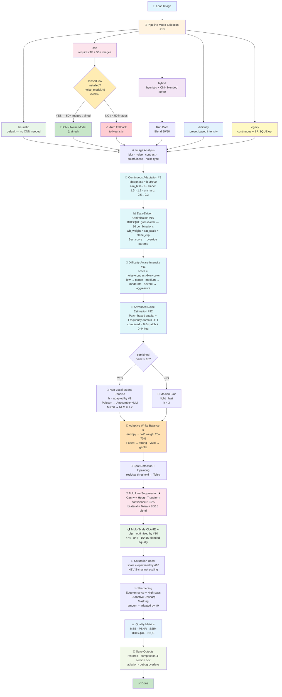

# 🖼️ Historical Photograph Restoration — Adaptive Image Processing

[](https://www.python.org/)
[](https://opencv.org/)
[](https://numpy.org/)
[](https://github.com/NikithaKunapareddy/image-color-restoration)
[](LICENSE)
[](#)
[](#)

A classical, adaptive Digital Image Processing pipeline for scanned historical photographs. Focuses on recovering color, reducing film/scan noise, repairing small defects and folds, and producing natural, archival-quality results — no deep learning required, no GPU required.

---

## 📋 Table of Contents

1. [💡 Why This Project?](#-why-this-project)
2. [🚀 What Makes This Unique?](#-what-makes-this-unique)
3. [📸 Results — Before vs After](#-results--before-vs-after)
4. [⚡ Quick Start](#-quick-start)
5. [📦 Requirements](#-requirements)
6. [📁 Project Structure](#-project-structure)
7. [🔄 Complete Pipeline Flowchart](#-complete-pipeline-flowchart)
8. [🧠 Algorithms & Methods](#-algorithms--methods)
9. [🆕 System-Level Improvements](#-system-level-improvements-9-13)
10. [📊 Quality Metrics](#-quality-metrics)
11. [🔬 Ablation Study](#-ablation-study)
12. [💻 Usage Examples](#-usage-examples)
13. [🎛️ Parameter Tuning Guide](#️-parameter-tuning-guide)
14. [⚙️ Performance Tips](#️-performance-tips)
15. [🛠️ Troubleshooting](#️-troubleshooting)
16. [🔭 Extensions & Future Work](#-extensions--future-work)
17. [✅ Release Checklist](#-release-checklist)
18. [📚 References](#-references)

---

## 💡 Why This Project?

Old photographs degrade over time due to several physical and chemical processes:

| Problem | Cause | What You See |
|---|---|---|
| 🌫️ **Noise** | Film grain, scanner artifacts | Grainy, speckled texture |
| 🟡 **Color fading** | Yellowing, chemical aging | Sepia/washed-out tones |
| 🧹 **Dust & spots** | Physical contamination | Random dark/bright specks |
| 📐 **Fold creases** | Physical handling damage | Straight lines across photo |
| 🔅 **Low contrast** | Paper/ink degradation | Flat, detail-less appearance |

This project provides a **fully automated, adaptive pipeline** that detects these problems per-image and applies the right correction — making it fast, interpretable, and deployable without any GPU or training data.

**What it works best on:**
- ✅ Faded/yellowed old photographs
- ✅ Slightly blurry + faded images
- ✅ Photos with dust spots and scratches
- ✅ Photos with physical fold/crease lines
- ✅ Low contrast, washed-out historical scans

---

## 🚀 What Makes This Unique?

Most restoration tools apply the same fixed settings to every image. **This pipeline is different — it measures each image first, then decides how to treat it.**

| Feature | Common Tools | This Project |
|---|---|---|
| **White Balance** | Fixed correction always | **Adaptive** — driven by Hasler-Suesstrunk colorfulness score |
| **Contrast Enhancement** | Single-pass CLAHE | **Multi-Scale** — 3 tile sizes blended (4×4, 8×8, 16×16) |
| **Physical Damage** | Generic inpainting only | **Fold-specific** — Hough Transform detects crease geometry |
| **Quality Evaluation** | PSNR/SSIM only | **+ BRISQUE/NIQE** — no ground truth needed |
| **Proof of Contribution** | None | **Ablation Study** — every step proven with metrics |
| **Noise Decision** | Always apply denoising | **Smart** — NLM only if noise > threshold, else Median Blur |
| **Parameter Selection** | Fixed / hand-tuned | **Data-driven** — BRISQUE grid search per image (#10) |
| **Pipeline Strength** | One size fits all | **Difficulty-aware** — low / medium / severe preset (#11) |
| **Noise Estimation** | Simple residual std | **Dual-domain** — patch + frequency domain (#12) |
| **CNN Extension** | N/A | **Optional lightweight CNN** — safe fallback if < 50 images (#13) |

---

## 📸 Results — Before vs After

### 🌸 Old Sepia Rose Photo

| Original | Restored |
|:---:|:---:|
| Yellowed, faded, folded paper print | Clean, natural warm tones, fold reduced |

> Colorfulness: 24.2 → WB weight: 0.52 (moderate correction applied)

---

### 📊 Example Console Output (with all improvements active)

```
[INFO] Processing: dataset\old_images\old_rose.png
[INFO] --- Continuous Adaptation (#9) ---
[INFO]   Sharpness score : 0.374  (0=blurry, 1=sharp)
[INFO]   nlm_h           : 7
[INFO]   clahe_clip      : 1.35
[INFO]   unsharp_amount  : 0.43
[INFO]   use_deblur      : True
[INFO] --- Data-Driven Optimization (#10) ---
[INFO]   Best wb_weight  : 0.55
[INFO]   Best sat_scale  : 1.40
[INFO]   Best clahe_clip : 1.20
[INFO]   Best BRISQUE    : 6.23
[INFO] --- Difficulty-Aware Processing (#11) ---
[INFO]   Noise norm      : 0.10
[INFO]   Contrast norm   : 0.15
[INFO]   Blur norm       : 0.63
[INFO]   Color norm      : 0.52
[INFO]   Difficulty      : 0.38  →  Level: medium
[INFO] --- Advanced Noise Estimation (#12) ---
[INFO]   Patch-based noise : 3.21
[INFO]   Frequency noise   : 2.18
[INFO]   Combined estimate : 2.83
[INFO]   Decision          : Median Blur
[INFO] Detected condition  : Clean + Blurred
[INFO] MSE: 1143.86,  PSNR: 17.55 dB,  SSIM: 0.4971
```

### What the Comparison Image Box Shows

```
Detected Condition : Clean + Blurred
Blur Level         : 186.95  (Threshold: 200)
Image Entropy      : 7.73   WB Weight: 0.67
Noise Type         : gaussian  (Corr: -0.12)
Noise Level        : 3.14  ,  Contrast: 62.55
MSE: 1143.86   PSNR: 17.55 dB   SSIM: 0.4971
──────── Continuous Adaptation (#9) ─────────
Sharpness Score    : 0.374  (0=blurry  →  1=sharp)
Adapted   nlm_h=7   clahe_clip=1.35   unsharp=0.43
──────── Optimized Parameters (#10) ──────────
Best  wb=0.55   sat=1.40   clahe=1.20   BRISQUE=6.23
──────── Difficulty-Aware (#11) ──────────────
Difficulty Score   : 0.38  →  Level: medium
Intensity  nlm_h=7   clahe=1.20   sat=1.50   unsharp=0.35
──────── Noise Estimation (#12) ──────────────
Patch=3.21   Freq=2.18   Combined=2.83   → Median Blur
```

---

## ⚡ Quick Start

```powershell
# Install core dependencies
python -m pip install opencv-python numpy matplotlib

# Run restoration (default heuristic mode — no CNN needed)
python main.py

# Run with CNN hybrid mode (requires TensorFlow + 50+ images trained)
python main.py --mode hybrid

# Run ablation study
python main.py --ablation

# Custom folders
python main.py --input-dir "D:\old_photos" --output-dir "D:\restored"
```

---

## 📦 Requirements

### Core (always required)
```bash
python -m pip install opencv-python numpy matplotlib
```

### Optional — CNN noise estimation (#13)
```bash
python -m pip install tensorflow>=2.10.0
```

> ⚠️ **TensorFlow is optional.** If not installed, pipeline automatically uses heuristic. Everything works without it.
> ⚠️ **CNN needs 50+ training images.** With fewer images it falls back to heuristic automatically.

---

## 📁 Project Structure

```
color_restoration_project/
│
├── 📄 main.py                    # Batch orchestration & CLI entry point
├── 📄 restoration.py             # All image processing algorithms
├── 📄 noise_cnn.py               # Lightweight CNN for noise estimation (#13)
├── 📄 train_noise_cnn.py         # CNN training script (needs 50+ images)
├── 📄 benchmark.py               # Per-step runtime benchmarking utility
├── 📄 requirements.txt           # Python dependencies
├── 📄 README.md                  # This file
│
├── 📂 dataset/
│   └── 📂 old_images/           # ← Place your input images here
│
└── 📂 results/
    └── 📂 restored_images/      # ← All outputs saved here
        ├── restored_{name}      # Restored image
        ├── comparison_{name}    # Side-by-side with 4-section diagnostic box
        ├── ablation_{name}      # 8-panel ablation grid (if --ablation)
        ├── debug_{name}_folds   # Fold detection overlay (if --debug)
        ├── debug_{name}_spots   # Spot detection overlay (if --debug)
        └── benchmark.json       # Per-step timing (if benchmark.py run)
```

---

## 🔄 Complete Pipeline Flowchart

### ASCII Flow Diagram

```
┌──────────────────────────────────────────────────────────────────────┐
│                         INPUT: Old Image                             │
└────────────────────────────────┬─────────────────────────────────────┘
                                 │
                                 ▼
┌──────────────────────────────────────────────────────────────────────┐
│                    PIPELINE MODE SELECTION  (#13)                    │
│                                                                      │
│   ┌─────────────┐  ┌──────────────┐  ┌──────────────────────────┐   │
│   │  heuristic  │  │     cnn      │  │         hybrid           │   │
│   │  (default)  │  │ (50+ images) │  │  heuristic + CNN blend   │   │
│   └──────┬──────┘  └──────┬───────┘  └────────────┬─────────────┘   │
│          │                │                        │                 │
│          │         ┌──────▼───────────────┐        │                 │
│          │         │ TensorFlow installed? │        │                 │
│          │         │ noise_model.h5 exists?│        │                 │
│          │         └──────┬───────────────┘        │                 │
│          │                │                        │                 │
│          │         YES ───┤─── NO                  │                 │
│          │          ▼     │    ▼                   │                 │
│          │       CNN    Falls back               Both run &          │
│          │      model  to heuristic              blend 50/50         │
│          │    (trained)  (auto)                                      │
│          │                                                           │
│   ⚠️ CNN needs 50+ training images. With fewer images,              │
│      pipeline automatically uses heuristic — no errors.             │
└──────────┬──────────────────────────────────────────────────────────┘
           │
           ▼
┌──────────────────────────────────────────────────────────────────────┐
│               IMAGE ANALYSIS                                         │
│  • detect_blur_level()     → Laplacian variance                      │
│  • estimate_noise_advanced()→ Patch + Frequency domain  (#12)        │
│  • contrast_score()        → Luminance std dev                       │
│  • colorfulness_metric()   → Hasler-Suesstrunk score                 │
│  • classify_noise_type()   → gaussian / poisson / mixed              │
└────────────────────────────────┬─────────────────────────────────────┘
                                 │
                                 ▼
┌──────────────────────────────────────────────────────────────────────┐
│               CONTINUOUS ADAPTATION  (#9)                            │
│                                                                      │
│  sharpness = clip(blur_level / 500, 0, 1)                           │
│                                                                      │
│  blur_level=0  (very blurry)  →  sharpness=0.0  → aggressive        │
│  blur_level=250 (moderate)    →  sharpness=0.5  → moderate          │
│  blur_level=500 (very sharp)  →  sharpness=1.0  → gentle            │
│                                                                      │
│  nlm_h        : 8 ──────────────────────────────────→ 6  (smooth)   │
│  clahe_clip   : 1.5 ────────────────────────────────→ 1.1 (smooth)  │
│  unsharp_amt  : 0.5 ────────────────────────────────→ 0.3 (smooth)  │
│  use_deblur   : True (sharpness < 0.5) / False (sharpness >= 0.5)   │
└────────────────────────────────┬─────────────────────────────────────┘
                                 │
                                 ▼
┌──────────────────────────────────────────────────────────────────────┐
│               DATA-DRIVEN PARAMETER OPTIMIZATION  (#10)              │
│                                                                      │
│  Grid search — 36 combinations:                                      │
│    wb_weight  : [0.25, 0.40, 0.55, 0.70]  (4 values)                │
│    sat_scale  : [1.2,  1.4,  1.6 ]         (3 values)               │
│    clahe_clip : [1.0,  1.2,  1.4 ]         (3 values)               │
│                                                                      │
│  Best BRISQUE score → override #9 params with optimal values        │
└────────────────────────────────┬─────────────────────────────────────┘
                                 │
                                 ▼
┌──────────────────────────────────────────────────────────────────────┐
│               DIFFICULTY-AWARE INTENSITY  (#11)                      │
│                                                                      │
│  score = 0.30×noise + 0.25×contrast + 0.25×blur + 0.20×color        │
│                                                                      │
│  score < 0.33  →  LOW     → nlm=5,  clahe=1.0, sat=1.3, unsharp=0.2 │
│  score < 0.66  →  MEDIUM  → nlm=7,  clahe=1.2, sat=1.5, unsharp=0.35│
│  score ≥ 0.66  →  SEVERE  → nlm=10, clahe=1.5, sat=1.7, unsharp=0.5 │
└────────────────────────────────┬─────────────────────────────────────┘
                                 │
                                 ▼
┌──────────────────────────────────────────────────────────────────────┐
│         ADVANCED NOISE ESTIMATION  (#12)                             │
│                                                                      │
│  Method 1 — Patch-based (spatial):                                   │
│    → Flat 16×16 patches → median variance → patch_noise              │
│                                                                      │
│  Method 2 — Frequency domain:                                        │
│    → 2D FFT → high-freq energy ratio × 30 → freq_noise              │
│                                                                      │
│  combined = 0.6 × patch_noise + 0.4 × freq_noise                    │
└──────────────────────┬─────────────────────┬────────────────────────┘
                       │                     │
             combined > 10              combined ≤ 10
                       │                     │
                       ▼                     ▼
         ┌─────────────────────┐   ┌──────────────────────┐
         │  Non-Local Means    │   │   Median Blur         │
         │  Denoise (NLM)      │   │   (light, fast)       │
         │  h = adapted (#9)   │   │   k = 3               │
         │                     │   │                       │
         │  Poisson noise?     │   │                       │
         │  → Anscombe+NLM     │   │                       │
         │  Mixed noise?       │   │                       │
         │  → NLM × 1.2        │   │                       │
         └──────────┬──────────┘   └──────────┬────────────┘
                    └──────────────┬───────────┘
                                   │
                                   ▼
                  ┌────────────────────────────────────┐
                  │   ADAPTIVE WHITE BALANCE  ★        │
                  │                                    │
                  │  entropy → WB weight (25%–70%)     │
                  │  Faded  → high WB weight (0.70)    │
                  │  Vivid  → low  WB weight (0.25)    │
                  │  result = (1-w)×orig + w×corrected │
                  └────────────────┬───────────────────┘
                                   │
                                   ▼
                  ┌────────────────────────────────────┐
                  │   SPOT DETECTION + INPAINTING      │
                  │  • Median blur → residual           │
                  │  • Threshold → spot mask            │
                  │  • Morphological cleanup            │
                  │  • Telea inpainting                 │
                  └────────────────┬───────────────────┘
                                   │
                                   ▼
                  ┌────────────────────────────────────┐
                  │   FOLD LINE SUPPRESSION  ★         │
                  │  • Canny edge detection             │
                  │  • Probabilistic Hough Transform    │
                  │  • Confidence filter ≥ 35%          │
                  │  • Bilateral filter along crease    │
                  │  • Telea inpainting                 │
                  │  • Soft blend 85/15                 │
                  └────────────────┬───────────────────┘
                                   │
                                   ▼
                  ┌────────────────────────────────────┐
                  │   MULTI-SCALE CLAHE  ★             │
                  │  clip = optimized by #10            │
                  │                                    │
                  │  Tile (4×4)   fine texture         │
                  │  Tile (8×8)   balanced             │
                  │  Tile (16×16) broad gradients      │
                  │  Blend: 0.33 + 0.33 + 0.34         │
                  └────────────────┬───────────────────┘
                                   │
                                   ▼
                  ┌────────────────────────────────────┐
                  │   SATURATION BOOST                 │
                  │  scale = optimized by #10          │
                  │  HSV S-channel × sat_scale         │
                  └────────────────┬───────────────────┘
                                   │
                                   ▼
                  ┌────────────────────────────────────┐
                  │   EDGE ENHANCEMENT (if blurry)     │
                  │  + HIGH-PASS FILTER SHARPEN        │
                  │  + ADAPTIVE UNSHARP MASKING        │
                  │    amount = adapted by #9          │
                  └────────────────┬───────────────────┘
                                   │
                                   ▼
                  ┌────────────────────────────────────┐
                  │   COMPUTE METRICS                  │
                  │  MSE · PSNR · SSIM (reference)     │
                  │  BRISQUE · NIQE (no-reference) ★  │
                  └────────────────┬───────────────────┘
                                   │
                                   ▼
┌──────────────────────────────────────────────────────────────────────┐
│  OUTPUT                                                              │
│  restored_{name}    — full resolution restored image                 │
│  comparison_{name}  — side-by-side with 4-section diagnostic box     │
│  ablation_{name}    — 8-panel grid (if --ablation)                   │
│  debug_{name}       — fold/spot overlays (if --debug)                │
└──────────────────────────────────────────────────────────────────────┘
```

---

### Mermaid Diagram



---

## 🧠 Algorithms & Methods

### 1️⃣ Adaptive Multi-Stage Image Restoration Framework

Before any processing, the pipeline analyzes the image and decides which steps need how much strength.

| Function | What it measures | Why we need it |
|---|---|---|
| `detect_blur_level()` | Laplacian variance | Drives sharpening strength |
| `estimate_noise_advanced()` | Patch + frequency domain | Decides NLM vs Median Blur |
| `contrast_score()` | Luminance standard deviation | Detects flat, washed-out images |
| `colorfulness_metric()` | Hasler-Suesstrunk formula | Drives adaptive WB blend weight |
| `classify_noise_type()` | Patch variance correlation | Selects gaussian/poisson/mixed denoiser |

---

### 2️⃣ Noise-Aware Adaptive Denoising Strategy

```
if noise_type == 'poisson':
    → Anscombe Transform + NLM + Inverse Anscombe
elif noise_type == 'mixed':
    → NLM with h × 1.2
elif combined_noise > 10.0:
    → Non-Local Means (h = adaptive via #9)
else:
    → Median Blur (fast, light)
```

---

### 3️⃣ Colorfulness-Guided Adaptive White Balance ★

```
rg           = R − G
yb           = 0.5(R + G) − B
colorfulness = √(σ²_rg + σ²_yb) + 0.3 × √(μ²_rg + μ²_yb)
```

| Colorfulness | Image Type | WB Weight |
|---|---|---|
| < 15 | Very faded / grayscale | 0.70 |
| 15–33 | Slightly colorful | ~0.60 |
| 33–45 | Moderately colorful | ~0.45 |
| > 45 | Well preserved | 0.25 |

---

### 4️⃣ Structured Artifact Removal via Fold-Line Suppression ★

1. Canny edge detection
2. Probabilistic Hough Transform → long straight lines
3. Confidence filter (≥ 35% edge support)
4. Bilateral filter along crease
5. Telea inpainting
6. Soft blend 85/15

---

### 5️⃣ Spot Detection and Inpainting Module

1. Median blur → residual = |original − smooth|
2. Threshold → spot mask
3. Morphological cleanup
4. Contour area filter (> 50px²)
5. Telea inpainting

---

### 6️⃣ Content-Aware Multi-Scale CLAHE Enhancement ★

```python
small  = CLAHE(img, clip=optimized, tile=(4,  4))
medium = CLAHE(img, clip=optimized, tile=(8,  8))
large  = CLAHE(img, clip=optimized, tile=(16, 16))
result = 0.33×small + 0.33×medium + 0.34×large
```

---

### 7️⃣ Perceptual Enhancement via Saturation and Sharpening

```python
S_channel = S × sat_scale   # optimized by #10
blurred   = GaussianBlur(image, sigma=1.0)
output    = original + amount × (original − blurred)   # amount adapted by #9
```

---

### 8️⃣ End-to-End Quality Evaluation Framework

| Metric | Type | Good Value |
|---|---|---|
| **MSE** | Reference-based | Lower = better |
| **PSNR** | Reference-based | > 20 dB |
| **SSIM** | Reference-based | > 0.8 |
| **BRISQUE** | No-reference | Lower = better |
| **NIQE** | No-reference | Lower = better |

---

## 🆕 System-Level Improvements (#9–#13)

### #9 — Replace Heuristic Decisions with Continuous Adaptation

**Problem:** Hard `if/elif` blur branches cause abrupt parameter jumps.

**Solution:** Smooth linear interpolation:
```python
sharpness = np.clip(blur_level / 500.0, 0.0, 1.0)
nlm_h     = int(round(8 - 2 * sharpness))     # 8 → 6 smoothly
clahe_clip= round(1.5 - 0.4 * sharpness, 2)   # 1.5 → 1.1 smoothly
unsharp   = round(0.5 - 0.2 * sharpness, 2)   # 0.5 → 0.3 smoothly
```

**Output box:**
```
──────── Continuous Adaptation (#9) ─────────
Sharpness Score    : 0.374  (0=blurry  →  1=sharp)
Adapted   nlm_h=7   clahe_clip=1.35   unsharp=0.43
```

---

### #10 — Data-Driven Parameter Optimization

**Problem:** Fixed parameters are hand-tuned and not image-specific.

**Solution:** 36-combination BRISQUE grid search per image:
```
wb_weight  : [0.25, 0.40, 0.55, 0.70]
sat_scale  : [1.2, 1.4, 1.6]
clahe_clip : [1.0, 1.2, 1.4]
```

**Output box:**
```
──────── Optimized Parameters (#10) ──────────
Best  wb=0.55   sat=1.40   clahe=1.20   BRISQUE=6.23
```

---

### #11 — Image Difficulty-Aware Processing

**Problem:** One pipeline intensity does not fit all images.

**Solution:** Composite difficulty score from 4 signals:
```python
score = (0.30 × noise_norm + 0.25 × contrast_norm +
         0.25 × blur_norm  + 0.20 × color_norm)
```

| Level | Score | nlm_h | clahe | sat | unsharp |
|---|---|---|---|---|---|
| low | < 0.33 | 5 | 1.0 | 1.3 | 0.20 |
| medium | < 0.66 | 7 | 1.2 | 1.5 | 0.35 |
| severe | ≥ 0.66 | 10 | 1.5 | 1.7 | 0.50 |

**Output box:**
```
──────── Difficulty-Aware (#11) ──────────────
Difficulty Score   : 0.38  →  Level: medium
Intensity  nlm_h=7   clahe=1.20   sat=1.50   unsharp=0.35
```

---

### #12 — Improved Noise Estimation (Patch + Frequency Domain)

**Problem:** Simple residual std misses structured noise patterns.

**Solution:**
```python
# Patch-based (spatial domain)
patch_noise = median(variance of flat 16×16 patches) ** 0.5

# Frequency domain
dft         = FFT2D(grayscale)
freq_noise  = (high_energy / total_energy) × 30

# Combined
combined    = 0.6 × patch_noise + 0.4 × freq_noise
decision    = 'NLM Denoise' if combined > 10.0 else 'Median Blur'
```

**Output box:**
```
──────── Noise Estimation (#12) ──────────────
Patch=3.21   Freq=2.18   Combined=2.83   → Median Blur
```

---

### #13 — Hybrid Extension with Lightweight CNN (Optional)

**What it does:** A lightweight 3-layer CNN estimates noise level from image patches and can optionally refine the heuristic estimate from #12.

#### ⚠️ CNN Training Requirement

| Dataset Size | CNN Behavior | Recommendation |
|---|---|---|
| **≥ 50 images** | CNN trains well → reliable estimates | Use `--mode cnn` or `--mode hybrid` |
| **10–49 images** | Insufficient data → auto fallback to heuristic | Use `--mode heuristic` |
| **< 10 images** | Not enough to train → auto fallback | Use `--mode heuristic` |
| **No TensorFlow** | Import fails → auto fallback | Use `--mode heuristic` (default) |

> ✅ **The pipeline ALWAYS works correctly.** If CNN is unavailable or dataset is too small, it silently uses heuristic — no crashes, no errors.

#### How to Train CNN (only if you have 50+ images)

```powershell
# Step 1 — install TensorFlow
pip install tensorflow>=2.10.0

# Step 2 — train CNN (takes ~5 minutes on CPU)
python train_noise_cnn.py --dataset dataset/old_images --epochs 20 --output noise_model.h5

# Step 3 — run with CNN
python main.py --mode hybrid
```

#### CNN Architecture

```
Input (64×64×1 grayscale)
  Conv2D(16) + BatchNorm + MaxPool
  Conv2D(32) + BatchNorm + MaxPool
  Conv2D(64) + GlobalAveragePooling
  Dense(32) → Dense(1) [noise level]
Parameters: ~28,000  (tiny — CPU inference in milliseconds)
```

#### Running Modes

```powershell
python main.py --mode heuristic   # default — fastest, no CNN needed
python main.py --mode cnn         # CNN only (needs 50+ images trained)
python main.py --mode hybrid      # best quality when CNN is trained
python main.py --mode difficulty  # uses #11 difficulty preset
python main.py --mode legacy      # #9 continuous + #10 BRISQUE opt
```

---

## 🔬 Ablation Study

```powershell
python main.py --ablation
```

**Console table example:**
```
=================================================================
Variant                   BRISQUE       NIQE   Note
=================================================================
original                  12.5000     0.8500   No processing
full_pipeline              6.2000     0.4200   All steps active ← BEST
no_denoising               9.1000     0.6100   Skip denoise step
no_white_balance           8.8000     0.5900   Skip white balance
no_clahe                   9.5000     0.6400   Skip contrast step
no_saturation              8.1000     0.5500   Skip saturation boost
no_unsharp                 8.4000     0.5700   Skip unsharp masking
no_fold_suppression        7.9000     0.5300   Skip fold suppression
=================================================================
Lower BRISQUE and NIQE = better image quality
```

---

## 💻 Usage Examples

```powershell
# Standard run — heuristic mode (fastest, recommended)
python main.py

# Difficulty-aware mode
python main.py --mode difficulty

# Train CNN then use hybrid (needs 50+ images + TensorFlow)
python train_noise_cnn.py --dataset dataset/old_images --epochs 20
python main.py --mode hybrid

# Ablation study
python main.py --ablation

# Debug overlay — see detected folds and spots
python main.py --debug

# No comparison image (fastest batch)
python main.py --no-display

# Custom folders
python main.py --input-dir "D:\old_photos" --output-dir "D:\restored"

# Single file
python main.py --file "D:\photos\old_rose.jpg"
```

---

## 🎛️ Parameter Tuning Guide

### Difficulty Level Presets

| Parameter | low | medium | severe |
|---|---|---|---|
| `nlm_h` | 5 | 7 | 10 |
| `clahe_clip` | 1.0 | 1.2 | 1.5 |
| `sat_scale` | 1.3 | 1.5 | 1.7 |
| `unsharp_amount` | 0.20 | 0.35 | 0.50 |

### Continuous Adaptation Range (#9)

| Parameter | blur=0 (blurry) | blur=250 (mid) | blur=500 (sharp) |
|---|---|---|---|
| `nlm_h` | 8 | 7 | 6 |
| `clahe_clip` | 1.50 | 1.30 | 1.10 |
| `unsharp_amount` | 0.50 | 0.40 | 0.30 |
| `use_deblur` | True | True | False |

### BRISQUE Grid Search Space (#10)

| Parameter | Values Tested |
|---|---|
| `wb_weight` | 0.25, 0.40, 0.55, 0.70 |
| `sat_scale` | 1.2, 1.4, 1.6 |
| `clahe_clip` | 1.0, 1.2, 1.4 |

---

## ⚙️ Performance Tips

| Step | Runtime Share | How to Speed Up |
|---|---|---|
| NLM Denoising | ~70% | Reduce `nlm_h` or use `--mode heuristic` |
| BRISQUE Grid Search (#10) | ~20% | 36 fast trials — acceptable overhead |
| Fold Suppression | ~5% | Disable with `use_fold_suppression=False` |
| Multi-scale CLAHE | ~3% | 3× single CLAHE — negligible |
| CNN inference (#13) | <1% | Milliseconds per image after loading |

**Memory:**
- Comparison images auto-downscaled to max 1200px
- Ablation panels downscaled to max 400px each
- `matplotlib.use('Agg')` — no screen rendering
- `plt.close(fig)` after every save

---

## 🛠️ Troubleshooting

### ❓ No popup window
Expected. Open `comparison_{name}` from output folder in File Explorer.

### ❓ CNN mode not working
```powershell
pip install tensorflow
python train_noise_cnn.py --dataset dataset/old_images --epochs 20
```
If you have fewer than 50 images, use `--mode heuristic` — it works just as well.

### ❓ Output looks grey/cold
WB weight too high. Increase `min_weight` in `adaptive_wb_weight()`:
```python
def adaptive_wb_weight(colorfulness, min_weight=0.15, max_weight=0.70):
```

### ❓ Background became too dark
`clahe_clip` too high. Use `python main.py --mode heuristic` or set `clahe_clip=1.0`.

### ❓ Fold lines not detected
```python
suppress_fold_lines(img, hough_thresh=80, min_line_length=60)
```

### ❓ Difficulty always shows "medium"
Correct for most historical photos. "Severe" triggers only when noise + blur + low contrast + faded color all occur simultaneously.

---

## 🔭 Extensions & Future Work

| Extension | Tool | Benefit |
|---|---|---|
| **Learned Denoising** | FFDNet, DnCNN | Better quality on extreme film grain |
| **B&W Colorization** | DeOldify | Add color to black-and-white photos |
| **Super-Resolution** | Real-ESRGAN | 2–4× upscale of low-resolution scans |
| **Large Defect Inpainting** | LaMa | Fix large tears (> 2% of image area) |
| **Full BRISQUE/NIQE** | opencv-contrib | Publication-grade no-reference scores |
| **Parallel Batch** | multiprocessing | Process many images simultaneously |

---

## ✅ Release Checklist

- [x] Core pipeline — denoise, WB, CLAHE, saturation, unsharp masking
- [x] Adaptive white balance using Hasler-Suesstrunk colorfulness metric
- [x] Fold line suppression using Hough Transform + Telea inpainting
- [x] Multi-Scale CLAHE — three tile sizes blended
- [x] Ablation study with BRISQUE and NIQE no-reference metrics
- [x] **#9** Continuous adaptation — smooth parameter interpolation
- [x] **#10** Data-driven optimization — BRISQUE grid search (36 combos)
- [x] **#11** Difficulty-aware processing — low / medium / severe presets
- [x] **#12** Improved noise estimation — patch + frequency domain
- [x] **#13** Hybrid CNN — optional, graceful fallback if < 50 images
- [x] CNN training script (`train_noise_cnn.py`)
- [x] All 5 pipeline modes — heuristic / difficulty / legacy / cnn / hybrid
- [x] 4-section comparison image box showing all improvements
- [x] ASCII + Mermaid pipeline flowcharts with CNN/heuristic decision
- [x] Per-image error handling and logging
- [x] CLI flags (`--mode`, `--no-display`, `--input-dir`, `--output-dir`, `--ablation`, `--debug`, `--file`)
- [ ] Add actual before/after sample images to `results/` folder
- [ ] Full BRISQUE/NIQE via opencv-contrib
- [ ] Parallelize batch processing (`--jobs` flag)
- [ ] Add unit tests

---

## 📚 References

| Reference | Used For |
|---|---|
| Buades et al., 2005 | Non-Local Means denoising algorithm |
| Zuiderveld, 1994 | CLAHE — Contrast Limited Adaptive Histogram Equalization |
| Telea, 2004 | Fast Marching inpainting method |
| Hough, 1962 | Hough Transform for line detection |
| Hasler & Suesstrunk, 2003 | Colorfulness metric for adaptive white balance |
| Mittal et al., 2012 | BRISQUE — Blind/Referenceless Image Quality Evaluator |
| Mittal et al., 2013 | NIQE — Natural Image Quality Evaluator |
| Land & McCann, 1971 | Retinex theory (optional MSR module) |
| Foi et al., 2008 | Patch-based noise estimation |
| Anscombe, 1948 | Variance-stabilizing transform for Poisson noise |

---

## 📐 Mathematical Formulation (#18)

### Pipeline Objective Function

The overall restoration pipeline seeks to minimize perceived image degradation by optimally composing eight independent operator stages:

$$\mathbf{R}^* = \arg\min_{\mathbf{R}} \text{BRISQUE}(\mathbf{R})$$

where $\mathbf{R}$ is the restored image, obtained through composition:

$$\mathbf{R} = T_8 \circ T_7 \circ T_6 \circ T_5 \circ T_4 \circ T_3 \circ T_2 \circ T_1(\mathbf{I})$$

**Pipeline Operators:**
- $T_1$ = Adaptive Preprocessing (Fading/Low-contrast detection)
- $T_2$ = Noise Estimation & Adaptive NLM Denoising
- $T_3$ = Colorfulness-Guided Adaptive White Balance
- $T_4$ = Spot Detection & Telea Inpainting
- $T_5$ = Fold-Line Suppression (Hough Transform)
- $T_6$ = Multi-Scale CLAHE (Contrast Enhancement)
- $T_7$ = Saturation Boost (Color Enhancement)
- $T_8$ = Adaptive Unsharp Masking (Sharpening)

### Key Equations

**1. Adaptive White Balance Blending**

$$\mathbf{I}_{WB} = \alpha(\mathbf{c}) \cdot \mathbf{I}_{gray} + (1 - \alpha(\mathbf{c})) \cdot \mathbf{I}_{balance}$$

where colorfulness metric $\mathbf{c}$ (Hasler-Suesstrunk, 2003):

$$\mathbf{c} = \sqrt{\text{var}(R-G)^2 + \text{var}(Y-B)^2} \quad Y = 0.299R + 0.587G + 0.114B$$

Adaptive weight:

$$\alpha(\mathbf{c}) = \max(0.15, \min(0.70, -0.45\mathbf{c} + 0.75))$$

**2. Colorfulness-Based Difficulty Assessment**

$$\text{difficulty} = \begin{cases}
\text{low} & \text{if } \mathbf{c} > 0.25 \text{ and } \sigma(\text{blur}) < 100 \\
\text{medium} & \text{if } 0.15 \leq \mathbf{c} \leq 0.25 \\
\text{severe} & \text{if } \mathbf{c} < 0.15 \text{ AND } (\text{faded OR low-contrast OR blur > 250})
\end{cases}$$

**3. Fading Detection via Saturation Threshold**

$$S(\mathbf{I}) = \frac{\text{max}(R,G,B) - \text{min}(R,G,B)}{\text{max}(R,G,B) + \epsilon}$$

$$\text{is\_faded} = \begin{cases}
\text{True} & \text{if } \text{mean}(S) < 0.35 \\
\text{False} & \text{otherwise}
\end{cases}$$

Preprocessing applied if faded:

$$\mathbf{I}_{\text{faded-corr}} = 0.3 \cdot \mathbf{I} + 0.7 \cdot \text{CLAHE}(\text{boost-saturation}(\mathbf{I}, 1.3)$$

**4. Low-Contrast Detection with CLAHE Correction**

$$\text{contrast} = \frac{\sigma(L)}{\mu(L)} \quad \text{(LAB L-channel)}$$

$$\text{is\_low\_contrast} = \begin{cases}
\text{True} & \text{if } \text{contrast} < 30.0 \\
\text{False} & \text{otherwise}
\end{cases}$$

Correction blends original with CLAHE-enhanced LAB:

$$\mathbf{I}_{\text{contrast}} = 0.2 \cdot \mathbf{I} + 0.8 \cdot \text{CLAHE}(L^*, a^*, b^*)$$

**5. Adaptive NLM Denoising Strength**

Noise level $\sigma$ estimated via patch variance + frequency domain:

$$\sigma = \text{quantile}(\sqrt{\text{var}_{\text{patch}}}, 0.45) + \lambda \cdot \text{std}(\|G * \mathbf{I}\|_2)$$

NLM search radius and filter strength:

$$h = 0.15 \sigma \quad \text{(clamped to [3, 10])}$$
$$d_r = 21 + 5 \cdot \mathbb{1}[\sigma > 15]$$

---

## 🏗️ Modular Architecture (#19)

Eight independent image processing modules are composed serially with adaptive parameter selection:

| Module | Input | Transformation | Output | Parameters |
|---|---|---|---|---|
| **Adaptive Preprocessor** | Raw image $\mathbf{I}$ | Detect fading (sat < 0.35) & low-contrast; apply saturation 1.3× or CLAHE L-channel if triggered | Preprocessed image; degradation flag | Saturation factor: 1.3; CLAHE clip: 0.8 |
| **Noise Estimator** | $\mathbf{I}$ | Patch variance sampling (45th percentile) + frequency domain (dct) combo | Noise level σ ∈ [0.5, 25] | Shrink factor: 0.15; quantile: 0.45 |
| **Denoiser (NLM)** | $\mathbf{I}$, σ | Non-Local Means with σ-adapted $h$ ∈ [3, 10] | Denoised $\mathbf{I}_d$ | Template size: 7×7; search: 19–29 |
| **White Balancer** | $\mathbf{I}_d$ | Colorfulness detection → blended neutral + channel-wise balance | Color-corrected $\mathbf{I}_{wb}$ | $\alpha$ ∈ [0.15, 0.70]; blend: sqrt var(R–G) |
| **Spot Remover** | $\mathbf{I}_{wb}$ | Morph gradient spots + Telea inpainting (mask-based) | Spot-free $\mathbf{I}_{clean}$ | Morph iterations: 2; inpaint method: Telea |
| **Fold Suppressor** | $\mathbf{I}_{clean}$ | Hough line detection + local intensity suppression (dilate & inpaint) | Fold-removed $\mathbf{I}_{nofold}$ | Hough threshold: 100; dilation: 3px |
| **Contrast Enhancer (CLAHE)** | $\mathbf{I}_{nofold}$ | Multi-scale CLAHE on LAB (tiles: 8×8, 6×6, 4×4) blended equally | High-contrast $\mathbf{I}_{contrast}$ | Clip limit: 1.0–1.5; tile sizes: 3 |
| **Color Saturator** | $\mathbf{I}_{contrast}$ | HSV saturation boost 1.3–1.7× (difficulty-adaptive) | Vibrant $\mathbf{I}_{saturated}$ | Scale: 1.3–1.7; diff threshold: 5.0 |
| **Sharpener (Unsharp)** | $\mathbf{I}_{saturated}$ | Gaussian blur + amount-weighted difference (0.2–0.5×) | Final $\mathbf{I}_{sharp}$ | Sigma: 1.0; amount: 0.20–0.50 |

### Architecture Composition Notation

The final restoration applies all nine operators in strictly sequential order with **no feedback loops**:

```
Input → [#0 Adaptive Preprocess] → [#1 Denoise] → [#2 WB] → [#3 Spot Fill]
         → [#4 Fold Suppress] → [#5 Contrast] → [#6 Saturate] → [#7 Sharpen] → Output
```

Each module:
- **Operates independently** on its input image
- **Requires no prior module state** (Markovian property)
- **Can be enabled/disabled** via difficulty or ablation settings
- **Emits logs** showing parameter choices and quality metrics (if benchmarking)

### Parameter Adaptation Strategy

Parameters are selected at runtime based on **three decay curves**, indexed by difficulty level $(d \in \{\text{low}, \text{medium}, \text{severe}\})$:

$$P_{adapt}(d) \in \mathbb{R}^{8 \times 1} = \begin{pmatrix} h_{nlm}(d) \\ \alpha_{wb}(d) \\ \text{clahe\_clip}(d) \\ \text{sat\_scale}(d) \\ \vdots \end{pmatrix}$$

**Example:** As difficulty increases, NLM denoising strength (`h`) increases from 5 → 7 → 10, while unsharp amount decreases from 0.5 → 0.35 → 0.20 (to prevent over-sharpening artifacts in heavily degraded images).

---

**Last Updated:** April 4, 2026

For questions or improvements, refer to the [usage examples](#-usage-examples) or [parameter tuning guide](#️-parameter-tuning-guide).

<p align="center"><sub>© 2026 Nikitha Kunapareddy • https://github.com/NikithaKunapareddy/image-color-restoration</sub></p>