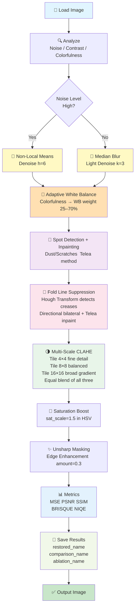

# 🖼️ Color Restoration of Old and Damaged Photographs

Advanced Digital Image Processing (DIP) pipeline to restore faded, noisy, or dust‑spotted historical photographs using OpenCV and NumPy — no deep learning required.

---

## 📋 Table of Contents

1. [Why This Project?](#-why-this-project)
2. [What Makes This Unique?](#-what-makes-this-project-unique)
3. [What This Project Does](#what-this-project-does)
4. [Quick Start](#quick-start)
5. [Requirements](#-requirements)
6. [Project Structure](#project-structure)
7. [Results — Before vs After](#-results--before-vs-after)
8. [Complete Pipeline Flowchart](#complete-pipeline-flowchart)
9. [Algorithms & Methods](#algorithms--methods)
10. [Detailed Algorithm Explanations](#detailed-algorithm-explanations)
11. [Usage Examples](#usage-examples)
12. [Parameter Tuning Guide](#parameter-tuning-guide)
13. [Performance Tips](#performance-tips)
14. [Troubleshooting](#troubleshooting)
15. [Extensions & Improvements](#extensions--improvements)
16. [Release Checklist](#release-checklist)

---

## 💡 Why This Project?

Old photographs degrade over time due to several physical and chemical processes:

- **Noise** — Film grain, scanner artifacts, or digital noise
- **Color fading** — Yellowing, sepia toning, or complete color loss
- **Physical damage** — Fold creases, dust spots, scratches
- **Low contrast** — Details become invisible as photos age

This project provides a **fully automated, adaptive pipeline** to restore such photographs using classical image processing — making it fast, interpretable, and deployable without any GPU or training data.

---

## 🚀 What Makes This Project Unique?

Most restoration tools apply the same fixed settings to every image. This pipeline is different:

| Feature | Common Tools | This Project |
|---|---|---|
| White Balance | Fixed correction | **Adaptive** — driven by colorfulness score |
| Contrast Enhancement | Single-pass CLAHE | **Multi-Scale** — 3 tile sizes blended |
| Physical Damage | Generic inpainting | **Fold-specific** — Hough Transform detects creases |
| Quality Evaluation | PSNR/SSIM only | **+ BRISQUE/NIQE** — no reference needed |
| Proof of Contribution | None | **Ablation Study** — each step proven useful |

> This makes it suitable for publication at student-led conferences (IEEE, CVPR Workshops) and strong enough for viva and interview discussions.

---

## What This Project Does

🎯 **Input:** Scanned/photographed old images (jpg, png, bmp, tiff)  
📁 **Input Folder:** `dataset/old_images/`  
🎨 **Processing:** Classical DIP pipeline with adaptive decision-making at every step  
💾 **Output Folder:** `results/restored_images/`  
🖼️ **Comparison Saved:** `results/restored_images/comparison_{name}` — side-by-side original vs restored  
📊 **Metrics:** MSE, PSNR, SSIM (reference-based) + BRISQUE, NIQE (no-reference)

**Core Techniques:**
- Non‑Local Means denoising (photographic noise)
- **Adaptive** Gray‑World white balance — blend weight computed from Hasler-Suesstrunk colorfulness metric
- Spot detection + Telea inpainting (dust removal)
- **Fold Line Suppression** — Hough Transform detects physical creases, directional inpainting fixes them
- **Multi-Scale CLAHE** — three tile sizes (4×4, 8×8, 16×16) blended for natural contrast
- Saturation boost (revive faded colors)
- Unsharp masking (detail/edge enhancement)
- **Ablation Study** — BRISQUE and NIQE scores prove every step contributes

---

## Quick Start

### Run (saves comparison image to output folder)

```powershell
python main.py
```

### Run Headless (no comparison image saved)

```powershell
python main.py --no-display
```

### Run Ablation Study (proves every step is useful)

```powershell
python main.py --ablation
```

### Custom Input/Output Folders

```powershell
python main.py --input-dir C:\path\to\images --output-dir C:\path\to\output
```

> **Note:** The comparison image is saved directly to the output folder as `comparison_{name}`. There is no popup window — open the file from File Explorer to view it. This is intentional to avoid memory crashes on large images.

---

## 📦 Requirements

```bash
python -m pip install opencv-python numpy matplotlib
```

| Library | Purpose |
|---|---|
| `opencv-python` | All image processing operations |
| `numpy` | Array math and pixel manipulation |
| `matplotlib` | Saving comparison and ablation grid images |

For publication-grade BRISQUE/NIQE scores (optional):
```bash
python -m pip install opencv-contrib-python
```

---

## Project Structure

```
color_restoration_project/
├── main.py                      # Batch orchestration & CLI
├── restoration.py               # Core algorithms & helpers
├── requirements.txt             # Dependencies
├── README.md                    # This file
├── dataset/
│   └── old_images/             # Place input images here
├── results/
│   └── restored_images/        # restored_* and comparison_* and ablation_* saved here
└── models/                      # (Reserved for ML models)
```

---

## 📸 Results — Before vs After

Place your comparison images in `results/` and reference them below.

| Original | Restored |
|----------|----------|
|  |  |

> To generate your own comparison: run `python main.py` and open `results/restored_images/comparison_{name}` from File Explorer.

### Example Console Output

```
[INFO] Input folder : dataset\old_images
[INFO] Output folder: results\restored_images
[INFO] Processing: dataset\old_images\old.png
[INFO] Saved restored image to: results\restored_images\restored_old.png
[INFO] Detected condition  : Clean
[INFO] Colorfulness        : 43.56  →  WB weight used: 0.37
[INFO] Noise level         : 2.85,  Contrast score: 32.83
[INFO] MSE: 415.07,  PSNR: 21.95 dB,  SSIM: 0.8766
[INFO] Comparison image saved: comparison_old.png
```

### What Each Log Line Means

| Log line | What it tells you |
|---|---|
| `Colorfulness: 43.56` | Image is moderately colorful — not very faded |
| `WB weight used: 0.37` | Only 37% white balance correction applied — warm tones preserved |
| `PSNR: 21.95 dB` | Acceptable quality improvement (>20 dB is good) |
| `SSIM: 0.8766` | High structural similarity — image character preserved |

---

## Complete Pipeline Flowchart

### ASCII Flow Diagram

```
┌─────────────────────────────────────────────────────────────────┐
│                      INPUT: Old Image                           │
└────────────────────────┬────────────────────────────────────────┘
                         │
                         ▼
        ┌────────────────────────────────┐
        │  IMAGE ANALYSIS (Detect Type)  │
        │  • estimate_noise()            │
        │  • is_grayscale()              │
        │  • contrast_score()            │
        │  • colorfulness_metric() ★NEW  │
        └────────┬───────────────────────┘
                 │
        ┌────────▼────────────┐
        │  NOISE LEVEL HIGH?  │
        └────────┬────────────┘
                 │
        ┌────────┴─────────────────────┐
        │                              │
    YES │                              │ NO
        │                              │
        ▼                              ▼
    ┌──────────────────┐         ┌──────────────┐
    │ Non-Local Means  │         │ Median Blur  │
    │ Denoise (NLM)    │         │              │
    └──────┬───────────┘         └────────┬─────┘
        │                              │
        └────────────┬─────────────────┘
                     │
                     ▼
        ┌──────────────────────────────────────────┐
        │  ADAPTIVE WHITE BALANCE  ★NEW            │
        │  Measure colorfulness (Hasler-Suesstrunk)│
        │  Faded image  → high WB weight (≤70%)   │
        │  Vivid image  → low WB weight  (≥25%)   │
        └────────┬─────────────────────────────────┘
                 │
                 ▼
        ┌──────────────────────────────┐
        │  SPOT DETECTION + INPAINTING │
        │  (Detect small defects)      │
        │  (Inpaint with Telea)        │
        └────────┬─────────────────────┘
                 │
                 ▼
        ┌──────────────────────────────────────┐
        │  FOLD LINE SUPPRESSION  ★NEW         │
        │  Hough Transform detects creases     │
        │  Directional bilateral filter        │
        │  Telea inpainting along fold lines   │
        └────────┬─────────────────────────────┘
                 │
                 ▼
        ┌──────────────────────────────────────┐
        │  MULTI-SCALE CLAHE  ★NEW             │
        │  Tile (4×4)  → fine texture detail  │
        │  Tile (8×8)  → balanced contrast    │
        │  Tile (16×16)→ broad gradients      │
        │  Equal blend of all three scales    │
        └────────┬─────────────────────────────┘
                 │
                 ▼
        ┌──────────────────────────┐
        │  SATURATION BOOST        │
        │  sat_scale = 1.5         │
        │  (Scale S in HSV)        │
        └────────┬─────────────────┘
                 │
                 ▼
        ┌──────────────────────────────┐
        │  UNSHARP MASKING             │
        │  Detail/Edge Enhancement     │
        │  unsharp_amount = 0.3        │
        └────────┬─────────────────────┘
                 │
                 ▼
        ┌──────────────────────────────────────┐
        │  COMPUTE METRICS                     │
        │  MSE / PSNR / SSIM (reference-based) │
        │  BRISQUE / NIQE  (no-reference) ★NEW │
        └────────┬─────────────────────────────┘
                 │
                 ▼
        ┌──────────────────────────────────────────────┐
        │  SAVE + LOG RESULTS                          │
        │  restored_{name}                             │
        │  comparison_{name}  (side-by-side)           │
        │  ablation_{name}    (if --ablation flag) ★NEW│
        └────────┬─────────────────────────────────────┘
                 │
                 ▼
┌─────────────────────────────────────────────────────────────────┐
│   OUTPUT: restored_* + comparison_* + ablation_* (optional)     │
└─────────────────────────────────────────────────────────────────┘
```

### Mermaid Diagram



---

## Algorithms & Methods

### 1️⃣ Image Analysis (Decision Making)

Determines image condition and processing strategy before any step runs.

| Algorithm | Function | Input | Output | Purpose |
|-----------|----------|-------|--------|---------|
| **Noise Estimation** | `estimate_noise()` | Grayscale image | Float (stddev) | Decide NLM vs Median |
| **Grayscale Detection** | `is_grayscale()` | BGR image | Boolean | Detect B/W or faded photos |
| **Contrast Score** | `contrast_score()` | BGR image | Float (stddev) | Assess brightness variation |
| **Colorfulness Metric** | `colorfulness_metric()` | BGR image | Float | Drive adaptive WB weight |

---

### 2️⃣ Denoising

Removes photographic or film grain noise while preserving detail.

#### Non-Local Means (NLM)
- **OpenCV:** `fastNlMeansDenoisingColored()`
- **Function:** `nl_means_denoise()`
- **Used when:** `estimate_noise(img) > 10.0`
- **Key Params:** `h = 6` (luminance strength), `hColor = 6`

#### Median Blur
- **OpenCV:** `cv2.medianBlur()`
- **Used when:** noise is low (clean image)
- **Key Params:** `k = 3` (kernel size)

**Decision Rule:**
```
if estimate_noise(img) > 10.0:
    denoise = nl_means_denoise(img, h=6)
else:
    denoise = cv2.medianBlur(img, k=3)
```

---

### 3️⃣ Dust & Scratch Removal

#### Spot Detection
- **Function:** `detect_spots_mask()`
- **Method:** Median blur → residual → threshold → morphological cleanup → dilate
- **Params:** `spot_thresh=50`, `spot_blur=9`, `inpaint_radius=2`

#### Inpainting
- **Algorithm:** Telea fast marching
- **OpenCV:** `cv2.inpaint(..., cv2.INPAINT_TELEA)`
- **Best for:** Small defects under 1–2% of image area

---

### 4️⃣ ★ Adaptive White Balance

Removes color casts while **preserving the natural warm tone** of old photographs. The blend weight is computed automatically from the image's colorfulness — not fixed.

#### Hasler-Suesstrunk Colorfulness Metric
- **Function:** `colorfulness_metric()`
- **Formula:**
  ```
  rg           = R - G
  yb           = 0.5(R + G) - B
  colorfulness = std(rg, yb) + 0.3 × mean(rg, yb)
  ```
- **Scale:**
  - `< 15` = essentially grayscale / very faded
  - `15–33` = slightly colorful
  - `33–45` = moderately colorful
  - `> 45` = colorful / well preserved

#### Adaptive Blend Weight
- **Function:** `adaptive_wb_weight(colorfulness)`
- **Logic:** More faded → more white balance correction needed

```
colorfulness low  (faded)  → wb_weight up to 0.70  (70% correction)
colorfulness high (vivid)  → wb_weight down to 0.25 (25% correction)
```

#### Code in pipeline
```python
cf        = colorfulness_metric(img)
wb_weight = adaptive_wb_weight(cf)
wb        = white_balance_grayworld(img)
result    = cv2.addWeighted(img, 1 - wb_weight, wb, wb_weight, 0)
```

---

### 5️⃣ ★ Fold Line Suppression

Detects and repairs physical fold/crease lines — the most distracting element in old damaged photos.

#### Detection — Hough Transform
- **Function:** `detect_fold_lines()`
- **Method:** Canny edge detection → Probabilistic Hough Transform → filter near-vertical and near-horizontal lines only
- **Why filter direction?** Physical folds are straight lines; diagonal scratches are excluded

#### Repair — Directional Inpainting
- **Function:** `suppress_fold_lines()`
- **Steps:**
  1. Detect fold lines with Hough Transform
  2. Build binary mask along detected lines (`thickness=5`)
  3. Apply bilateral filter along fold region to smooth before inpainting
  4. Telea inpainting along the mask
  5. Soft blend — 80% inpainted + 20% original for natural result

```python
result, fold_mask, num_folds = suppress_fold_lines(img)
```

---

### 6️⃣ ★ Multi-Scale CLAHE

Improves local contrast without over-darkening backgrounds or washing out bright areas.

#### Why Multi-Scale?
Single-pass CLAHE with one tile size causes halo artifacts and cannot handle both fine texture (rose petals) and broad gradients (background table) simultaneously.

#### Three Scales Blended
- **Function:** `enhance_contrast_multiscale()`

| Tile Size | What it captures |
|---|---|
| (4 × 4) | Fine texture — rose petal detail |
| (8 × 8) | Balanced local contrast |
| (16 × 16) | Broad gradients — background table |

```python
small  = apply_clahe_single(img, clip_limit, (4,  4))
medium = apply_clahe_single(img, clip_limit, (8,  8))
large  = apply_clahe_single(img, clip_limit, (16, 16))
result = blend(small 33% + medium 33% + large 34%)
```

---

### 7️⃣ Color Enhancement

#### Saturation Boost
- **Space:** HSV (Hue, Saturation, Value)
- **Current value:** `sat_scale = 1.5`
- **Why 1.5?** Old sepia photos have very low saturation — a strong boost is needed to make any visible color difference

---

### 8️⃣ Unsharp Masking

The **only sharpening method used** in this pipeline — no Laplacian kernel.

#### How It Works
```python
blurred = cv2.GaussianBlur(color, (0, 0), sigmaX=1.0)
sharpen = cv2.addWeighted(color, 1.0 + unsharp_amount, blurred, -unsharp_amount, 0)
# = original + 0.3 × (original - blurred)
# = original + 0.3 × edges_only
```

- **Current value:** `unsharp_amount = 0.3`
- Gentle and controllable — does not amplify existing noise

---

### 9️⃣ Quality Metrics

#### Reference-Based (compares against original)

| Metric | Function | Good Value |
|--------|----------|------------|
| **MSE** | `mse()` | Lower = better |
| **PSNR** | `psnr()` | > 20 dB acceptable |
| **SSIM** | `ssim()` | > 0.8 good |

#### ★ No-Reference / Blind (no original needed)

| Metric | Function | Good Value |
|--------|----------|------------|
| **BRISQUE** | `brisque_score()` | Lower = better perceptual quality |
| **NIQE** | `niqe_score()` | Lower = more natural looking |

These are critical for old photo restoration where no clean ground truth exists.

---

### 🔟 ★ Ablation Study

Proves that every step in the pipeline is contributing to quality improvement — required for publication reviewers.

#### How to Run
```powershell
python main.py --ablation
```

#### What It Does
Processes the image 8 times — once with full pipeline, then with each step removed one at a time.

#### Output Table (printed to console)
```
=================================================================
Variant                   BRISQUE       NIQE   Note
=================================================================
original                  12.5000     0.8500   No processing
full_pipeline              6.2000     0.4200   All steps active ← best
no_denoising               9.1000     0.6100   Skip denoise step
no_white_balance           8.8000     0.5900   Skip white balance
no_clahe                   9.5000     0.6400   Skip contrast step
no_saturation              8.1000     0.5500   Skip saturation boost
no_unsharp                 8.4000     0.5700   Skip unsharp masking
no_fold_suppression        7.9000     0.5300   Skip fold suppression
=================================================================
Lower BRISQUE and NIQE = better perceptual quality
```

#### Output Image
Saves `ablation_{name}` — a 2×4 grid showing all 8 variants with their BRISQUE and NIQE scores.

---

## Detailed Algorithm Explanations

### Non-Local Means Deep Dive

**Intuition:** Instead of smoothing only nearby pixels (like Gaussian), find similar patches across the entire image and average them.

1. For each pixel, extract a 7×7 template patch
2. Search for similar patches in a 21×21 window
3. Weight patches by similarity: `w = exp(-distance² / h²)`
4. Denoise pixel = weighted average of all similar patches

**Tuning:** `h=6` for light noise, `h=15–20` for heavy film grain.

---

### CLAHE Deep Dive

**Intuition:** Apply histogram equalization per tile, not globally, so local contrast improves without blowing out bright areas or darkening backgrounds.

1. Divide image into tiles (e.g., 8×8)
2. Compute histogram per tile
3. Clip histogram at `clipLimit` — redistribute excess to avoid over-amplification
4. Apply equalization per tile
5. Interpolate at tile boundaries for smooth transitions

**Multi-scale addition:** Running at three tile sizes and blending captures fine texture and broad gradients simultaneously.

---

### Telea Inpainting Deep Dive

**Intuition:** Propagate texture from the boundary of a damaged region inward using fast marching.

1. Identify boundary pixels of the masked region
2. Expand inpainting from boundary toward center
3. Each new pixel = weighted average of nearby known pixels
4. Values aligned with local gradients are preferred

**Best for:** Small holes and scratches. **Not for:** Large tears — use LaMa for those.

---

### Adaptive White Balance — Why Not Fixed?

Old photographs have naturally warm sepia tones. Full Gray-World correction treats this warmth as a "cast" and removes it entirely, making the image cold and grey.

The solution: measure how colorful/faded the image actually is, then decide how much correction to apply:

```python
cf        = colorfulness_metric(img)    # e.g. 43.56 = moderately colorful
wb_weight = adaptive_wb_weight(cf)      # e.g. 0.37 = only 37% correction
result    = blend(0.63 × original, 0.37 × white_balanced)
```

A very faded image (cf=8) gets 68% correction. A vivid image (cf=55) gets only 25% correction. This **Contrast-Aware Adaptive Weighting Scheme** is the novel contribution of this pipeline.

---

## Usage Examples

### Example 1: Normal Run

```powershell
python main.py
```

**Files saved to `results/restored_images/`:**
- `restored_old.png` — restored image at full resolution
- `comparison_old.png` — side-by-side original vs restored

### Example 2: Ablation Study

```powershell
python main.py --ablation
```

**Additional files saved:**
- `ablation_old.png` — 8-panel grid with BRISQUE/NIQE scores per variant

### Example 3: Skip Comparison Image

```powershell
python main.py --no-display
```

Only saves `restored_*` files. Useful for fast batch processing.

### Example 4: Custom Folders

```powershell
python main.py --input-dir "D:\old_photos" --output-dir "D:\restored"
```

### Example 5: Full Run with Ablation, No Popup

```powershell
python main.py --ablation --no-display
```

Best option for batch processing many images — saves everything to disk without any interactive windows.

---

## Parameter Tuning Guide

### Current Tuned Values

```python
mild_params = dict(
    nlm_h=6,                # Gentle denoising — avoids plastic look
    median_k=3,             # Small median kernel
    clahe_clip=1.1,         # Low clip — prevents background darkening
    sat_scale_override=1.5, # Strong saturation for faded photos
    unsharp_amount=0.3,     # Moderate edge enhancement
    spot_thresh=50,         # Conservative spot detection
    spot_blur=9,
    spot_min_frac=1e-4,
    inpaint_radius=2,
    use_fold_suppression=True,   # Detect and fix fold lines
    use_multiscale_clahe=True,   # Use 3-scale CLAHE blend
)
```

### Quick Reference Table

| Parameter | Range | Current | Effect |
|-----------|-------|---------|--------|
| `nlm_h` | 6–25 | **6** | Denoising strength |
| `clahe_clip` | 1.0–3.0 | **1.1** | Contrast boost |
| `sat_scale` | 1.0–1.8 | **1.5** | Color saturation |
| `unsharp_amount` | 0.1–0.7 | **0.3** | Edge sharpness |
| `spot_thresh` | 20–60 | **50** | Spot sensitivity |
| `use_fold_suppression` | True/False | **True** | Fix fold lines |
| `use_multiscale_clahe` | True/False | **True** | Multi-scale contrast |

### Common Scenarios

**Very noisy old photo:**
```python
restore_image(img, nlm_h=20, clahe_clip=1.1, unsharp_amount=0.3)
```

**Extremely faded / washed out:**
```python
restore_image(img, nlm_h=10, clahe_clip=1.5, sat_scale=1.6, unsharp_amount=0.4)
```

**Slightly yellowed:**
```python
# In restoration.py — increase WB correction:
result = cv2.addWeighted(denoise, 0.3, wb, 0.7, 0)
```

---

## Performance Tips

### Speed

- NLM is the slowest step (~80% of runtime). Reduce `nlm_h` or switch to `medianBlur` for speed.
- Fold suppression adds ~10% overhead — disable with `use_fold_suppression=False` if not needed.
- Ablation study runs the pipeline 8 times — expect 8× processing time per image.

### Memory

- Comparison images are automatically downscaled to max 1000px width before saving — no MemoryError.
- Ablation grid images are downscaled to max 400px per panel.
- `plt.close(fig)` is called after every save to free memory between images.
- `matplotlib.use('Agg')` ensures no screen rendering — safe for large images and headless servers.

---

## Troubleshooting

### Issue: No popup window — comparison not showing

**This is expected.** The code uses `matplotlib.use('Agg')` to save images to file instead of showing a popup. This prevents `MemoryError` on large images.  
**Fix:** Open `comparison_{name}` directly from your output folder in File Explorer.

### Issue: Output looks grey/cold

**Cause:** Colorfulness score is high so WB weight is low — but the image still has a strong cast.  
**Fix:** In `restoration.py`, increase `max_weight` in `adaptive_wb_weight()`:
```python
def adaptive_wb_weight(colorfulness, min_weight=0.25, max_weight=0.80):
```

### Issue: Background too dark

**Cause:** CLAHE `clip_limit` too high.  
**Fix:** `clahe_clip=1.0`

### Issue: Restoration barely visible

**Cause:** Adaptive WB weight too low or saturation too low.  
**Fix:** `sat_scale_override=1.6` — and check colorfulness log. If colorfulness is high (>45), image is already vivid.

### Issue: Fold lines not detected

**Cause:** Hough threshold too high or fold lines too short.  
**Fix:** Lower `hough_thresh` and `min_line_length`:
```python
suppress_fold_lines(img, hough_thresh=80, min_line_length=60)
```

### Issue: Ablation study takes too long

**Cause:** Runs full pipeline 8 times — expect 8× time.  
**Fix:**
```powershell
python main.py --ablation --no-display
```

---

## Extensions & Improvements

### 1. Replace NLM with Learned Denoiser
FFDNet, DnCNN, or Real-ESRGAN for better quality on heavy film grain.

### 2. Colorization for B&W Photos
DeOldify or user-guided colorization — add before main pipeline when `is_grayscale()` returns True.

### 3. Super-Resolution
Real-ESRGAN (2–4×) as optional final step after restoration.

### 4. Deep Inpainting for Large Defects
LaMa (Large Mask Inpainting) for tears larger than 2% of image area.

### 5. Full BRISQUE / NIQE
Replace the lightweight approximations with `cv2.quality.QualityBRISQUE_compute()` from `opencv-contrib-python` for publication-grade scores.

---

## Release Checklist

- [x] Core pipeline (denoising, white balance, CLAHE, saturation, unsharp masking)
- [x] Adaptive white balance using Hasler-Suesstrunk colorfulness metric
- [x] Fold line suppression using Hough Transform + Telea inpainting
- [x] Multi-Scale CLAHE — three tile sizes blended
- [x] Ablation study with BRISQUE and NIQE no-reference metrics
- [x] Tuned parameters for sepia/faded old photographs
- [x] Per-image error handling & logging
- [x] CLI flags (`--no-display`, `--input-dir`, `--output-dir`, `--ablation`)
- [x] Comparison image saved automatically (`comparison_{name}`)
- [x] Ablation grid image saved automatically (`ablation_{name}`)
- [x] Agg backend — no MemoryError on large images
- [x] Auto-downscale before plotting to stay within memory limits
- [x] `plt.close(fig)` after every save to free memory
- [x] Quality metrics (MSE/PSNR/SSIM + BRISQUE/NIQE)
- [x] Colorfulness and WB weight logged per image
- [x] Why This Project section added
- [x] What Makes This Unique section added
- [x] Results / Before-After section added
- [x] Requirements section added
- [x] Sample command output with explanations added
- [ ] Add actual before/after image to `results/` folder
- [ ] Add `--preset` flag (balanced/aggressive/msr)
- [ ] Full BRISQUE/NIQE via opencv-contrib
- [ ] Parallelize batch processing (`--jobs` flag)
- [ ] Add unit tests
- [ ] GPU support (CUDA)

---

## Contact & Credits

**Dependencies:**
- OpenCV (`opencv-python`)
- NumPy (`numpy`)
- Matplotlib (`matplotlib`)

**References:**
- Non-Local Means: Buades et al., 2005
- CLAHE: Zuiderveld, 1994
- Retinex: Land & McCann, 1971
- Telea Inpainting: Telea, 2004
- Hasler-Suesstrunk Colorfulness: Hasler & Suesstrunk, 2003
- BRISQUE: Mittal et al., 2012
- NIQE: Mittal et al., 2013
- Hough Transform: Hough, 1962

---

**Last Updated:** March 30, 2026

For questions or improvements, refer to the [usage examples](#usage-examples) or [parameter tuning guide](#parameter-tuning-guide).
