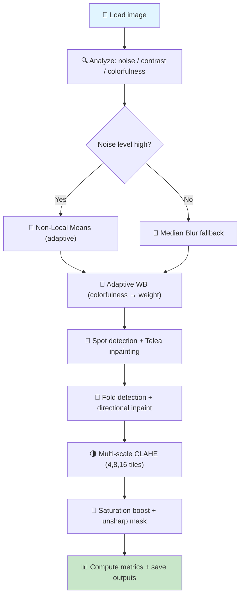

# 🖼️ Image Color Restoration — Photographic Conservation Toolkit

[](https://www.python.org/)
[](LICENSE)
[](#)
[](#)

A concise, production-minded restoration pipeline for scanned historical photographs. The project focuses on recovering color, reducing film/scan noise, repairing small defects and folds, and producing natural, archival-quality results.

---

## 📋 Table of Contents

1. [Overview](#overview)
2. [Quick Start](#quick-start)
3. [Project Structure](#project-structure)
4. [Pipeline Overview](#pipeline-overview)
5. [Algorithms & Methods](#algorithms--methods)
6. [Usage Examples](#usage-examples)
7. [Parameter Tuning](#parameter-tuning)
8. [Performance & Troubleshooting](#performance--troubleshooting)
9. [Extensions & Roadmap](#extensions--roadmap)
10. [Release Checklist](#release-checklist)

---

## Overview

This repository implements a classical, well-documented restoration pipeline for scanned historical images (JPG/PNG/TIFF). The code is deliberately dependency-light and intended for reproducible archival workflows.

I/O
- Input: `dataset/old_images/`
- Output: `results/restored_images/` (restored_*, comparison_*, ablation_*)

Quality metrics
- Reference-based: MSE, PSNR, SSIM
- No-reference: BRISQUE, NIQE (optional; requires `opencv-contrib-python`)

Highlights
- ✅ Non-Local Means denoising (adaptive strength)
- ✅ Adaptive white balance guided by Hasler–Süsstrunk colorfulness metric
- ✅ Spot/dust detection + Telea inpainting
- ✅ Fold/crease suppression with Hough detection + directional inpainting
- ✅ Multi-scale CLAHE (4×4, 8×8, 16×16) blended for natural contrast
- ✅ Saturation and conservative unsharp masking tuned for archival tones
- ✅ Ablation tooling to quantify each stage's impact (BRISQUE/NIQE)

---

## Quick start

Install dependencies and run the pipeline:

```powershell
python -m pip install -r requirements.txt
python main.py
```

Options
- `--no-display` — headless run (recommended for batch processing)
- `--input-dir` / `--output-dir` — override locations
- `--ablation` — save an 8-panel ablation grid comparing pipeline variants
 - `--preset` — choose `conservative`, `balanced`, or `aggressive` processing presets (see Parameters)

New utilities
- `benchmark.py` — simple per-step timing utility (run to measure CPU cost of each stage)

All outputs are saved to `results/restored_images/`. Comparison images are written to disk to avoid GUI/memory issues on large images or headless servers.

---

## Requirements

Install core dependencies:

```bash
python -m pip install -r requirements.txt
```

Minimum: `opencv-python`, `numpy`, `matplotlib`.
Optional for advanced metrics: `opencv-contrib-python` (BRISQUE/NIQE).

The pipeline is CPU-friendly — GPU is optional and only relevant for future learned components.

---

## Repository layout

```
image-color-restoration/
├── main.py                 # CLI and batch orchestration
├── restoration.py          # Core processing pipeline and helpers
├── wiener_deblur.py        # Optional classical deblurring experiments (kept out of main pipeline)
├── requirements.txt        # Python dependencies
├── README.md               # Documentation
├── dataset/                # Input images: dataset/old_images/
└── results/                # Outputs: results/restored_images/
```

---

## Results and outputs

Saved files (per image `name.ext`):

- `restored_name.png` — final restored image
- `comparison_name.png` — side-by-side original / restored
- `ablation_name.png` — 8-panel ablation grid (if `--ablation`)

Console logs show per-image analysis (colorfulness, noise estimate) and computed metrics when a reference is available.

---


## Pipeline overview

The pipeline is designed to be conservative and explainable. Steps (configurable in `restoration.py`):

1. Analysis — compute noise estimate, contrast score and colorfulness.
2. Denoise — Non-Local Means (adaptive `h`) or median fallback.
3. Adaptive white balance — blend original + gray-world corrected using a colorfulness-driven weight.
4. Spot/dust removal — residual thresholding → mask → Telea inpaint.
5. Fold suppression — Hough line detection → create mask → directional smoothing + inpaint.
6. Multi-scale CLAHE — apply CLAHE at tile sizes (4×4, 8×8, 16×16), then blend.
7. Saturation & unsharp — conservative saturation boost and gentle unsharp mask.
8. Metrics & save — compute MSE/PSNR/SSIM and BRISQUE/NIQE (optional) and save outputs.

### Mermaid flow (maintained in-source)



---

## Algorithms & formulas

Key formulas used in the repository (displayed for reviewers):

- Hasler–Süsstrunk colorfulness (implementation uses channel differences):

$$
rg = R - G \qquad yb = 0.5(R + G) - B
$$
$$
	ext{Colorfulness} = \sqrt{\sigma_{rg}^2 + \sigma_{yb}^2} + 0.3\,\sqrt{\mu_{rg}^2 + \mu_{yb}^2}
$$

- Mean Squared Error (MSE) and Peak Signal to Noise Ratio (PSNR):

$$
MSE = \frac{1}{WH} \sum_{x=1}^{W}\sum_{y=1}^{H} (I(x,y) - K(x,y))^2
$$
$$
PSNR = 10 \log_{10}\left(\frac{MAX_I^2}{MSE}\right)
$$

- Notes on SSIM: SSIM is computed via the standard luminance/contrast/structure decomposition (see `skimage.metrics.structural_similarity`).

Algorithmic notes
- NLM denoising: `cv2.fastNlMeansDenoisingColored()` with adaptive `h` controlled by the estimated noise.
- CLAHE: applied to the L channel (Lab colorspace) at three tile sizes; results are blended to avoid halos.
- Fold suppression: Hough detection builds a thin mask (line thickness tuned) followed by local directional smoothing and inpainting.

## Usage examples

Standard run:

```powershell
python main.py
```

Ablation (no display):

```powershell
python main.py --ablation --no-display
```

Batch processing:

```powershell
python main.py --input-dir "D:\old_photos" --output-dir "D:\restored"
```

## Parameters and presets

Default parameters are defined in `restoration.py`. Example presets (suggested):

- `conservative` — minimal color shifts, low CLAHE, low unsharp (safe for archival)
- `balanced` — default tuned values (recommended for general restoration)
- `aggressive` — stronger saturation and contrast for visually dramatic results

Example parameter table (defaults shown):

| Parameter | Default | Notes |
|---:|:---:|---|
| `nlm_h` | 6 | Denoise strength (increase for grain)
| `clahe_clip` | 1.1 | Local contrast clip limit
| `sat_scale` | 1.5 | Saturation multiplier
| `unsharp_amount` | 0.3 | Edge enhancement

The codebase now includes a working `--preset` flag (see `main.py`) that maps to these configurations.
To run an aggressive preset:

```powershell
python main.py --preset aggressive
```

To run the benchmark utility:

```powershell
python benchmark.py --input dataset/old_images/old.png --output results/benchmark.json --repeats 3
```

## Performance & troubleshooting

- NLM denoising is the heaviest cost — for throughput reduce `nlm_h` or use the median fallback.
- Use `--no-display` for headless servers and CI.
- If fold suppression misses creases: lower `hough_thresh` and `min_line_length` in `restoration.py`.

If you want, I can add a small benchmark script that measures per-step runtime on a sample image.

## Extensions & roadmap

- Replace NLM with learned denoisers (FFDNet, DnCNN) for extreme grain.
- Add LaMa for large-mask inpainting (tears, large missing regions).
- Add optional super-resolution (Real-ESRGAN) and learned colorization (DeOldify) as separate modules.

## Release checklist

- [x] Core restoration pipeline implemented
- [x] Adaptive white balance and multi-scale CLAHE
- [x] Fold suppression and spot inpainting
- [x] Ablation tooling and metric collection
- [ ] Add before/after sample images to `results/`
- [ ] Add unit tests and CI

## Credits

Core dependencies: OpenCV, NumPy, Matplotlib.

References: Buades et al. (NLM), Zuiderveld (CLAHE), Telea (inpainting), Hasler & Süsstrunk (colorfulness), Mittal et al. (BRISQUE/NIQE).

**Last updated:** April 3, 2026

Want this even more polished? I can:

- add a small result gallery (`results/` images + markdown embeds)
- implement the `--preset` flag with three preset configurations
- add a lightweight benchmarking script and CI job

Reply with which of the above you want next and I will implement it.
